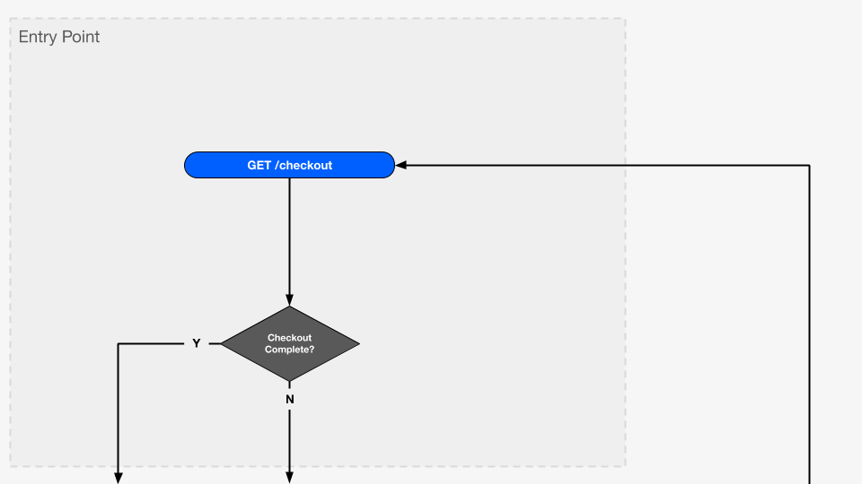
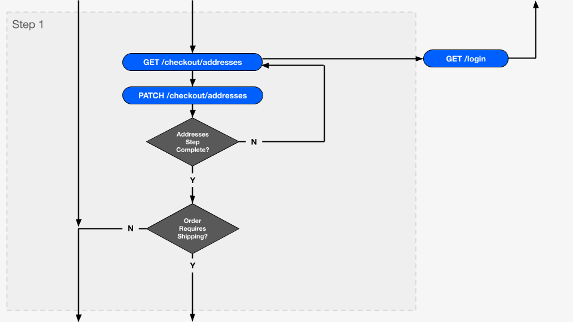
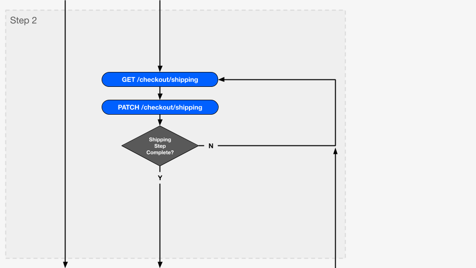
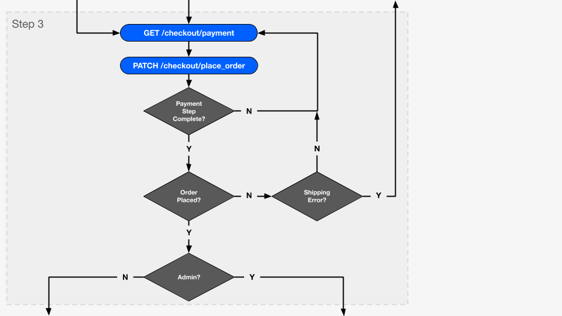
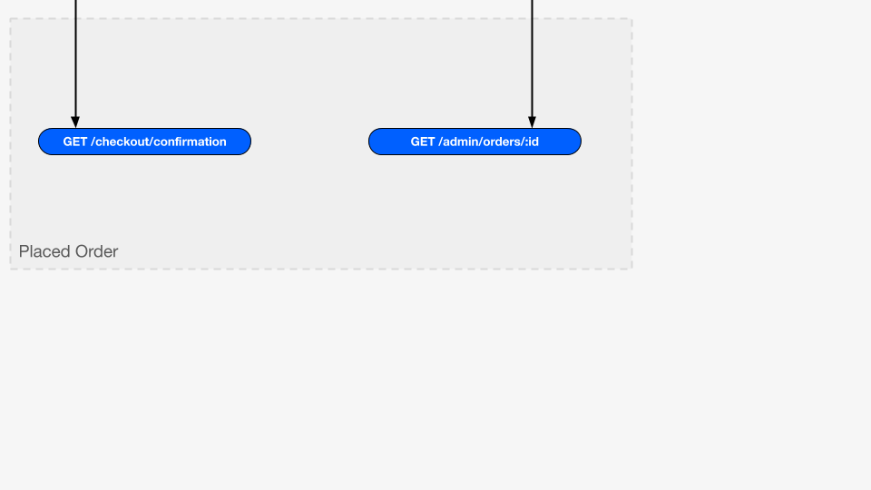
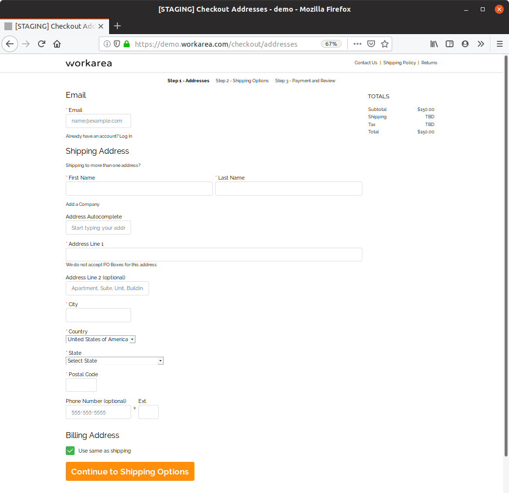
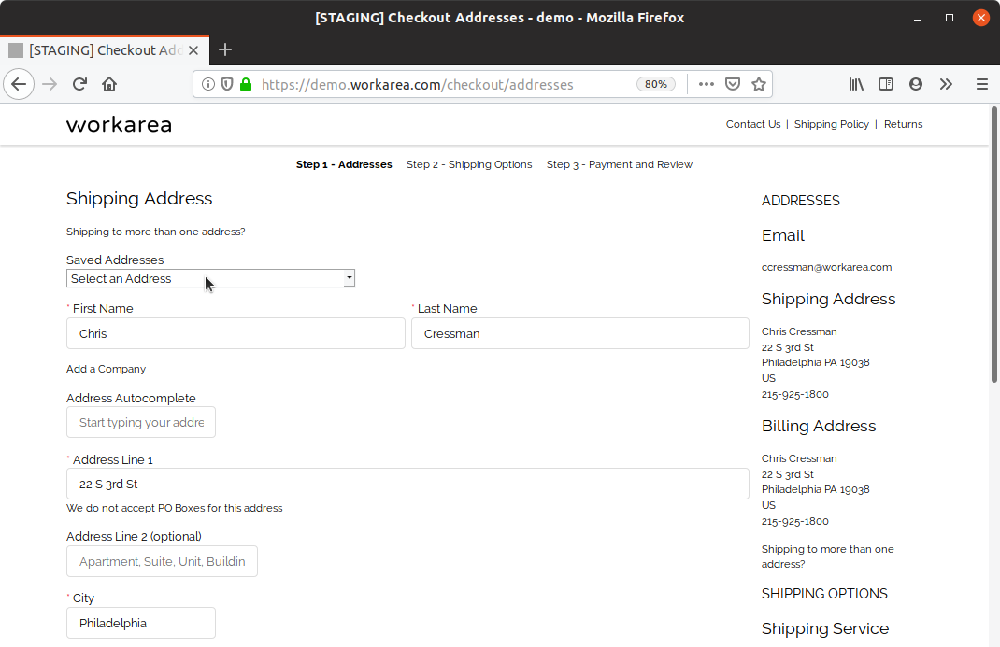
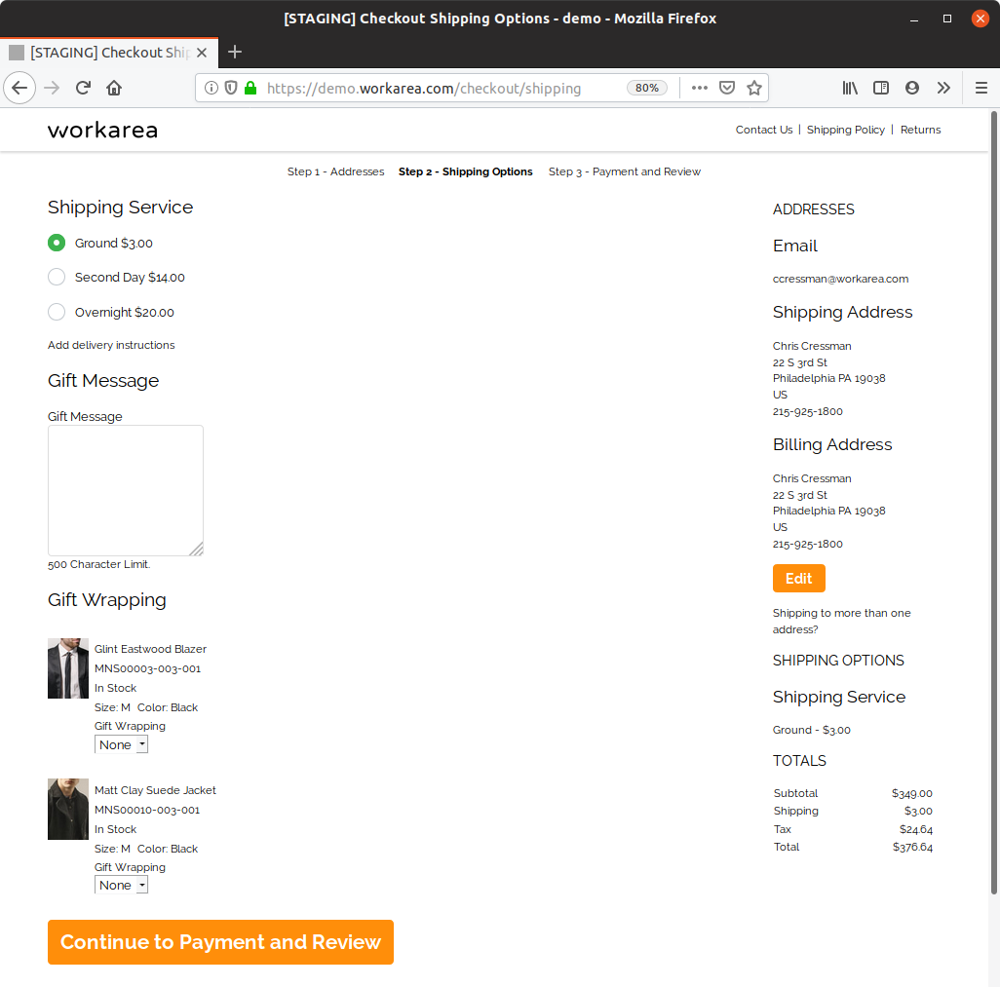
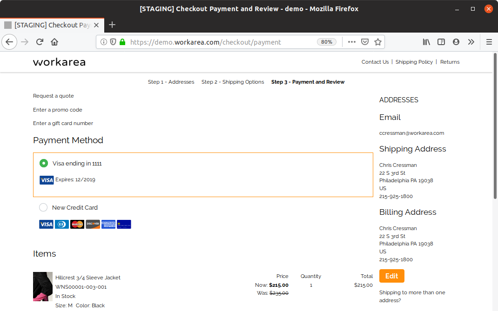
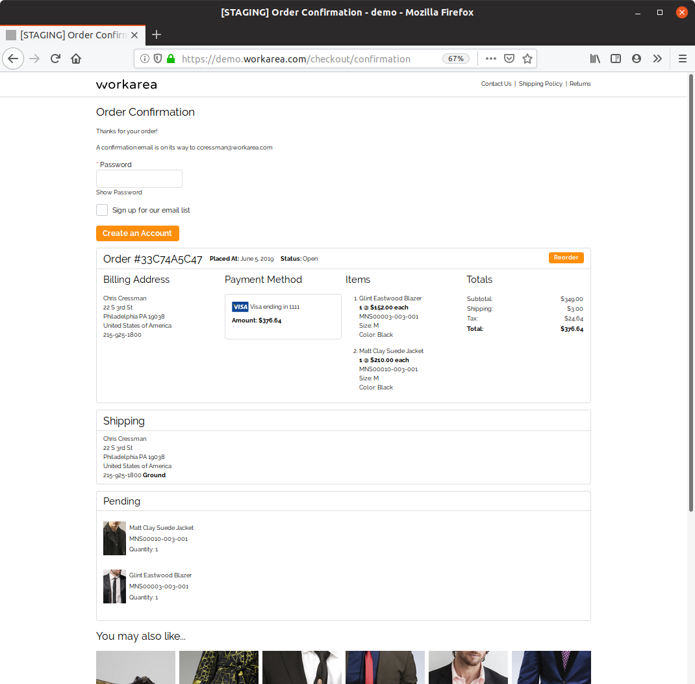

Checkout
======================================================================

Checkout is the process that completes and records a transaction (a sale) between a shopper and the retailer.
Checkout gets the [order](orders.html), [shippings](shipping.html), and payment into the states necessary to place the order.

This doc first covers checkout from the perspective of models (modeling) and controller actions (flow).
Then it covers each step in more detail, including shared implementation.
The doc concludes with a brief explanation of checkout extension, such as changing a step or adding a new step.


Modeling
----------------------------------------------------------------------

Consider the example of a user checking out who is currently browsing `/checkout/addresses`.
Within the context of this web request in the Storefront, `current_checkout` provides an instance of `Workarea::Checkout`, initialized from `current_order` and (if available) `current_user`.

```ruby
current_checkout.class
# => Workarea::Checkout

current_checkout.order.present?
# => true

current_checkout.user.present?
# => false
```

The example above represents a _guest_ checkout (no user), which is currently _incomplete_, meaning the order cannot be placed.

```ruby
current_checkout.complete?
# => false
```

Checkout is completed through a series of steps.
Each of these steps is modeled by a class.

```ruby
puts current_checkout.steps
# Workarea::Checkout::Steps::Addresses
# Workarea::Checkout::Steps::Shipping
# Workarea::Checkout::Steps::Payment
```

As needed throughout checkout, a checkout step object is initialized.
A checkout step object is always initialized with a checkout instance.

```ruby
addresses_step = current_checkout.steps.first.new(current_checkout)
```

As the shopper progresses through checkout, each checkout request re-initializes the current checkout object and the object representing the current checkout step.
Each step of checkout _updates_ the checkout until the step is _complete_.

Each checkout step model therefore responds to `#update` and `#complete?`.
The `#update` method uses the given params to mutate and persist the underlying transactional models (i.e. order, shippings, payment).
The `#complete?` method determines if those transactional models are in the necessary states to continue to the next step of checkout (or place the order).

```ruby
# addresses step is incomplete

addresses_step.complete?
# => false

# collect params from the shopper and update the checkout

address_params = {
  first_name: 'Ben',
  last_name: 'Crouse',
  street: '22 S 3rd St',
  city: 'Philadelphia',
  region: 'PA',
  postal_code: '19106',
  country: 'US',
  phone_number: '2159251800'
}

addresses_step.update(
  email: 'bcrouse@workarea.com',
  shipping_address: address_params,
  billing_address: address_params
)

# addresses step is now complete

addresses_step.complete?
# => true
```

This process of updating a step until it is complete is repeated until all steps of checkout are complete.
At that point, the checkout itself is considered complete, and the order can be placed.

```ruby
# query the checkout status
current_checkout.complete?
# => true

# place the order
current_checkout.place_order
# => true
```

The examples above illustrate the checkout process from the perspective of the checkout models.
However, in practice, shoppers check out via a series of web requests in the Storefront.
This flow is covered next.


Flow
----------------------------------------------------------------------

The checkout UI in the Storefront guides a shopper through a series of Storefront web requests, each of which collects the necessary data from the shopper to complete a particular step of checkout.
After all steps are complete, the order is placed, and the shopper is redirected to a view of the placed order.

The entire flow is illustrated in the following diagram.
The sections following the diagram provide additional details for each step.












Entry Point
----------------------------------------------------------------------

The checkout entry point determines which step of checkout to initially present to the shopper.

It's possible for a checkout to be complete (`Checkout#complete?`) as soon as it is initialized.
In this case, data from the checkout's user and other sources are used to _autocomplete_ the checkout, and the shopper is redirected to the final step of checkout (payment and place order).
From there, the shopper can make changes to the current and previous checkout steps, or they can simply click "Place Order" to finish checking out.

If a checkout cannot be autocompleted (e.g. there is no user, or there isn't enough information stored on the user), the shopper is redirected to the addresses step to begin checkout.


### Code

Run the following command from your application/plugin root to list relevant code files for this step:

```bash
echo $(bundle show workarea-storefront)/app/controllers/workarea/storefront/checkouts_controller.rb
```


Step 1: Addresses
----------------------------------------------------------------------

The addresses step of checkout collects the shopper's email address, shipping address, and billing address.
Any or all of these may be pre-filled from data stored on the user.
The shipping and billing addresses may be entered as new addresses or selected from a menu of saved addresses.
The billing address may also be entered by choosing "Same as Shipping", which is selected by default.

Addresses step, guest checkout:



(
The screenshot above includes shipping to multiple addresses and address autocomplete.
These features are provided by plugins and are not covered in this doc.
)

Here is the addresses step as a returning user:




### Routes

* `GET /checkout/addresses`
* `PATCH /checkout/addresses`


### `update` Params

* `:email`
* `:shipping_address`
* `:billing address`


### `complete?` Conditions

* Order is valid (`Order#valid?`)
* Payment address is present and valid (`Payment#address`, `Payment::Address#valid?`)
* If order requires shipping (`Order#fulfilled_by?(:shipping)`), all shippings are shippable (`Shipping#shippable?`)


### Code

Run the following command from your application/plugin root to list relevant code files for this step:

```ruby
echo "
$(bundle show workarea-core)/app/models/workarea/checkout/steps/addresses.rb
$(bundle show workarea-core)/test/models/workarea/checkout/steps/addresses_test.rb
$(bundle show workarea-storefront)/app/controllers/workarea/storefront/checkout/addresses_controller.rb
$(bundle show workarea-storefront)/app/view_models/workarea/storefront/checkout/addresses_view_model.rb
$(bundle show workarea-storefront)/test/view_models/workarea/storefront/checkout/addresses_view_model_test.rb
$(bundle show workarea-storefront)/app/assets/javascripts/workarea/storefront/modules/address_region_fields.js
$(bundle show workarea-storefront)/app/assets/javascripts/workarea/storefront/modules/checkout_addresses_forms.js
$(bundle show workarea-storefront)/app/assets/javascripts/workarea/storefront/templates/saved_addresses_property.jst.ejs
$(bundle show workarea-storefront)/app/assets/javascripts/workarea/storefront/templates/same_as_shipping_button_property.jst.ejs
$(bundle show workarea-storefront)/app/views/workarea/storefront/checkouts/addresses.html.haml
$(bundle show workarea-storefront)/app/assets/stylesheets/workarea/storefront/components/_checkout_addresses.scss
"
```


Step 2: Shipping
----------------------------------------------------------------------

The shipping step of checkout collects the shopper's choice of shipping service and, optionally, shipping instructions.
A shipping service is always selected by default, but the shopper can change the shipping service if more than one is available.
Changing the service asynchronously updates the UI to reflect the effects on order pricing.
The shipping instructions field is a simple text field that is hidden by default.

The shipping step:



(
The screenshot above includes shipping to multiple addresses, gift message, and gift wrapping.
These features are provided by plugins and are not covered in this doc.
)


### Routes

* `GET /checkout/shipping`
* `PATCH /checkout/shipping`


### `update` Params

* `:shipping_service`
* `:shipping_instructions`


### `complete?` Conditions

* Order is valid (`Order#valid?`)
* If order requires shipping (`Order#fulfilled_by?(:shipping)`), first shipping is valid (`Shipping#valid?`)


### Code

Run the following command from your application/plugin root to list relevant code files for this step:

```ruby
echo "
$(bundle show workarea-core)/app/models/workarea/checkout/steps/shipping.rb
$(bundle show workarea-core)/test/models/workarea/checkout/steps/shipping_test.rb
$(bundle show workarea-core)/app/models/workarea/checkout/shipping_options.rb
$(bundle show workarea-core)/test/models/workarea/checkout/shipping_options_test.rb
$(bundle show workarea-storefront)/app/controllers/workarea/storefront/checkout/shipping_controller.rb
$(bundle show workarea-storefront)/app/view_models/workarea/storefront/checkout/shipping_view_model.rb
$(bundle show workarea-storefront)/app/assets/javascripts/workarea/storefront/modules/checkout_shipping_services.js
$(bundle show workarea-storefront)/app/views/workarea/storefront/checkouts/shipping.html.haml
$(bundle show workarea-storefront)/app/assets/stylesheets/workarea/storefront/components/_checkout_shipping.scss
"
```


Step 3: Payment & Place Order
----------------------------------------------------------------------

The third and final step of checkout collects payment and then places the order after the checkout is considered complete.
Payment may be the ID of a saved credit card, or it may be a new credit card (in which case the value of `:payment` is `'new_card'`, and the additional param `:credit_card` contains the credit card attributes; e.g. `:number`).

The payment step, guest checkout:


(
The "Enter a Promo Code" button, shown above, reveals an additional promo code form, which is separate from the checkout form.
The form submits to `PATCH /cart/add_promo_code` and then returns the shopper to this step of checkout.
Therefore, although this form appears within the checkout UI, it is not part of checkout from a modeling and flow standpoint and isn't included in the discussions above.

The screenshot above also includes quoting, gift cards, and shipping to multiple addresses.
These features are provided by plugins and are not covered in this doc.
)

Here is the payment step as a returning user:



Placing the order has various effects; some inline with the original web request, others deferred as background jobs.
Investigate the following Ruby API calls to see all the effects:

* `Order#place`
* `Checkout#place_order`
* `Checkout#place_order_side_effects`
* `Storefront::Checkout::PlaceOrderController#completed_place_order`
* `SaveUserOrderDetails#perform`
* `MarkDiscountsAsRedeemed#perform`
* `SaveOrderMetrics#perform`

For convenience, run the following command from your application/plugin root to list the source files where the above methods are defined:

```ruby
echo "
$(bundle show workarea-core)/app/models/workarea/order.rb
$(bundle show workarea-core)/app/models/workarea/checkout.rb
$(bundle show workarea-storefront)/app/controllers/workarea/storefront/checkout/place_order_controller.rb
$(bundle show workarea-core)/app/workers/workarea/save_user_order_details.rb
$(bundle show workarea-core)/app/workers/workarea/mark_discounts_as_redeemed.rb
$(bundle show workarea-core)/app/workers/workarea/save_order_metrics.rb
"
```


### Routes

* `GET /checkout/payment`
* `PATCH /checkout/place_order`


### `update` Params

* `:payment`
* `:credit_card`


### `complete?` Conditions

* Order is purchasable (`Order#purchasable?`)
* Payment is purchasable for the total price of the order (`Payment#purchasable?`, `Order#total_price`)


### Code

Run the following command from your application/plugin root to list relevant code files for this step:

```ruby
echo "
$(bundle show workarea-core)/app/models/workarea/checkout/steps/payment.rb
$(bundle show workarea-core)/test/models/workarea/checkout/steps/payment_test.rb
$(bundle show workarea-core)/app/models/workarea/checkout/credit_card_params.rb
$(bundle show workarea-storefront)/app/controllers/workarea/storefront/checkout/payment_controller.rb
$(bundle show workarea-storefront)/app/controllers/workarea/storefront/checkout/place_order_controller.rb
$(bundle show workarea-storefront)/app/view_models/workarea/storefront/checkout/payment_view_model.rb
$(bundle show workarea-storefront)/test/view_models/workarea/storefront/checkout/payment_view_model_test.rb
$(bundle show workarea-storefront)/app/assets/javascripts/workarea/storefront/modules/checkout_primary_payments.js
$(bundle show workarea-storefront)/app/views/workarea/storefront/checkouts/payment.html.haml
$(bundle show workarea-storefront)/app/assets/stylesheets/workarea/storefront/components/_checkout_payment.scss
"
```


Placed Order
----------------------------------------------------------------------

After the order is placed, the shopper is redirected to a view of the placed order.
If the shopper is an administrator with `:order` permissions, they are redirected to the placed order in the Admin.
Otherwise, the shopper is redirected to the _checkout confirmation_: a Storefront view of the placed order.



If the checkout was a guest checkout, the checkout confirmation page includes a form which allows the shopper to create a user account.
If the shopper creates their account, a background job copies details from the checkout (e.g. addresses, payment) to their user account.


### Routes

* `GET /checkout/confirmation`
* `GET /admin/orders/:id`


### Code

Run the following command from your application/plugin root to list relevant code files for the Storefront checkout confirmation page:

```ruby
echo "
$(bundle show workarea-storefront)/app/controllers/workarea/storefront/checkout/place_order_controller.rb
$(bundle show workarea-storefront)/app/view_models/workarea/storefront/checkout/confirmation_view_model.rb
$(bundle show workarea-storefront)/app/views/workarea/storefront/checkouts/confirmation.html.haml
"
```


Shared Implementation
----------------------------------------------------------------------

The steps of checkout have a consistent "chrome" and therefore share some of their implementation.
This includes a checkout layout, a progress indicator, and the checkout summary which displays as an aside throughout checkout.

Run the following command from your application/plugin root to list the source files for the checkout shared implementation.

```ruby
echo "
$(bundle show workarea-core)/app/models/workarea/checkout.rb
$(bundle show workarea-core)/test/models/workarea/checkout_test.rb
$(bundle show workarea-core)/app/models/workarea/checkout/auto_complete.rb
$(bundle show workarea-core)/app/models/workarea/checkout/collect_payment.rb
$(bundle show workarea-core)/test/models/workarea/checkout/collect_payment_test.rb
$(bundle show workarea-core)/app/models/workarea/checkout/steps/base.rb
$(bundle show workarea-storefront)/app/controllers/workarea/storefront/checkouts_controller.rb
$(bundle show workarea-storefront)/app/controllers/workarea/storefront/current_checkout.rb
$(bundle show workarea-storefront)/app/view_models/workarea/storefront/checkout_content.rb
$(bundle show workarea-storefront)/app/view_models/workarea/storefront/cart_view_model.rb
$(bundle show workarea-storefront)/app/view_models/workarea/storefront/checkout/summary_view_model.rb
$(bundle show workarea-storefront)/test/view_models/workarea/storefront/checkout/summary_view_model_test.rb
$(bundle show workarea-storefront)/app/views/layouts/workarea/storefront/checkout.html.haml
$(bundle show workarea-storefront)/app/views/workarea/storefront/checkouts/_checkout_progress.html.haml
$(bundle show workarea-storefront)/app/views/workarea/storefront/checkouts/_summary.html.haml
$(bundle show workarea-storefront)/app/views/workarea/storefront/checkouts/summary.html.haml
$(bundle show workarea-storefront)/app/assets/stylesheets/workarea/storefront/components/_checkout_progress.scss
$(bundle show workarea-storefront)/app/assets/stylesheets/workarea/storefront/components/_checkout_step_summary.scss
$(bundle show workarea-storefront)/test/integration/workarea/storefront/checkout_side_effects_integration_test.rb
$(bundle show workarea-storefront)/test/integration/workarea/storefront/checkouts_integration_test.rb
$(bundle show workarea-storefront)/test/integration/workarea/storefront/checkout_with_pricing_override_integration_test.rb
$(bundle show workarea-storefront)/test/integration/workarea/storefront/current_checkout_integration_test.rb
$(bundle show workarea-storefront)/test/system/workarea/storefront/guest_checkout_system_test.rb
$(bundle show workarea-storefront)/test/system/workarea/storefront/logged_in_checkout_system_test.rb
"
```


Extension
----------------------------------------------------------------------

You can extend checkout, either to change an existing step or to add a new step (or otherwise change the steps/flow).


### Change an Existing Step

To change an existing step, [decorate](decoration.html) the models and/or extend the UI code using the appropriate [extension](extension.html) techniques.
If decorating the model, extend `#update` to change which params are expected for an update, and extend `#complete?` to change the conditions for step completion.
For UI changes, refer to the listings of source files in the step-specific sections above.


### Add a Step

You may need to add a step (or, in some unlikely scenarios remove or re-order steps).
To add a step, complete the following:

1. Define the new model
2. Add the model to the step configuration
3. Update the checkout flow by changing the relevant controller actions
4. Add supporting UI code

Add a new class definition for your checkout step model.
The class should inherit from `Checkout::Steps::Base` and implement `#update` and `#complete?`.

Within an initializer, modify `Workarea.config.checkout_steps` to include your new class, in the correct position relative to the existing steps.
This config value is a SwappableList.
For example:

```ruby
Workarea.config.checkout_steps.insert_after(
  'Workarea::Checkout::Steps::Addresses',
  'Workarea::Checkout::Steps::GiftOptions'
)
```

Decorate the specific controller actions that control the flow to and from your new step.
Refer to the following list of controller actions which control flow from step to step.

* `Storefront::CheckoutsController#new`
* `Storefront::Checkout::AddressesController#completed_addresses_step`
* `Storefront::Checkout::AddressesController#incomplete_addresses_step`
* `Storefront::Checkout::ShippingController#completed_shipping_step`
* `Storefront::Checkout::ShippingController#incomplete_shipping_step`
* `Storefront::Checkout::PlaceOrderController#incomplete_place_order`
* `Storefront::Checkout::PlaceOrderController#completed_place_order`
* `Storefront::Checkout::PlaceOrderController#finished_checkout_destination`

Finally, create any additional UI code that is necessary to complete your step (e.g. view, view model).
Refer to the lists of code in the step-specific sections above as reference.
