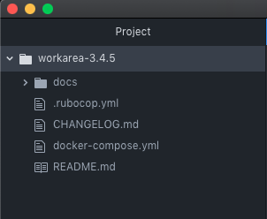
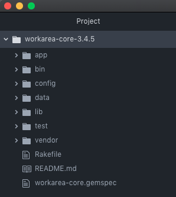

# Navigating the Code

It is not uncommon to face scenarios where you need to dig into the source code of Workarea to find answers to questions – whether you are looking to gain a better understanding of how something works, looking for the cause of a problem, or looking to expand functionality. This guide serves as an overview of how Workarea is constructed and the ways in which you can traverse its codebase to find what you're looking for.

## The Workarea gem

Workarea is a meta-gem much like the framework it is built on, Ruby on Rails. This means it contains no code of its own and is instead responsible for loading the four gems that represent the major pieces of any ecommerce application: workarea-core, workarea-admin, workarea-storefront, and workarea-testing. Each of these gems is a [Rails engine](https://guides.rubyonrails.org/engines.html), which are self-contained Rails applications that can be added to your application, providing everything that is needed to get an ecommerce project off the ground.

### workarea-core

Just as it sounds, `workarea-core` is the center of the Workarea platform. It is responsible for handling the data layer and all critical business logic that all the other pieces are built from. `workarea-core` is where you find the following:

- Models
- Queries
- Workers
- Configuration
- and more

If there is logic within an application that is not specific to any other part of the platform, you will find it in `workarea-core`.

### workarea-admin

Workarea comes with an admin UI out of the box that enables retailers to manage everything within their ecommerce site from an easily searchable, user-friendly interface. `workarea-admin` contains all the routing, controllers, views, and front-end assets required to power the administrative pages. The easiest way to tell if you're on an admin page is to look for the `/admin/` segment of a page's URL. If you see it, then you're in the admin!

### workarea-storefront

Customer-facing functionality is quite important for an ecommerce business. Luckily, Workarea provides an easily customizable storefront that provides functionality for a seamless checkout flow, powerful search, easily organized categories, handcrafted content pages and navigation, and user account management. The `workarea-storefront` gem provides the routes, controllers, views, and front-end assets for delivering a great user experience to retail customers.

This gem is the first place to look when looking for the behavior of search, categories, product pages, content, or checkout flow. By digging into the routes and controllers, you can more easily build an understand of how data is composed and displayed.

### workarea-testing

Every developer's favorite thing – tests. Workarea provides a robust testing configuration to allow developers to write tests without worrying about complex setup.

`workarea-testing` is where to look when you need a better understanding of how tests are setup, what is being done for each test, and what tools are provided to make writing tests easier.

## Finding the source

As mentioned before, Workarea is a meta-gem, and as a result finding what you're looking for can be a bit tricky. With a Ruby application, you can utilize `bundler` to find where the source code of any bundled gem is on our machine, open up that gem and dig in. This holds true for Workarea. In your application you can run `bundle show GEM_NAME` to get the path to the installed gem. Lets do that with `workarea`:

```bash
$ bundle show workarea
/Users/lincy/.rbenv/versions/2.4.4/lib/Ruby/gems/2.4.0/gems/workarea-3.4.5
```

This is where it can get tricky. Open the directory that your application provides the path to and you'll see this:



Not quite what you were hoping to see, right? Well, because Workarea is a meta-gem, the `workarea` gem itself doesn't contain any of the source code. Instead what you need to do is determine the specific gem that's needed to find the code you're looking for. Use the breakdown above for each gem to get an idea.

For example, if you are looking to figure out what fields are on a particular model, you would want to look at `workarea-core` – the data layer of Workarea.

```bash
$ bundle show workarea-core
/Users/mduffy/.rbenv/versions/2.4.4/lib/Ruby/gems/2.4.0/gems/workarea-core-3.4.5
```

Open the path in your editor, and you'll see:



That's more like it! From there you can follow normal Rails conventions and look at `app/models/workarea/` to find the model you're looking for.

This same process can be followed to look at the source of any other gem within `workarea` - whether it's looking at `workarea-storefront` to see the controller actions for checkout, or `workarea-admin` to determine how a workflow is constructed.

### Just git it

Instead of digging through the gem source itself, you can always browse the tagged version of the [Workarea repo on GitHub](https://github.com/workarea-commerce/workarea), and browse across the entire codebase at once.

For easier browsing, you can pull the codebase locally and checkout the tagged version you want to work with.

```bash
$ git clone git@github.com:workarea-commerce/workarea.git
# ...

$ cd workarea
$ git checkout v3.4.5
```

## Working from the outside-in

Now that you better understand where to find things, it can still be hard determining where to look to solve your problem. There are many layers to an application and finding the root of a problem is always the hardest part.

### Controllers

With Workarea, you can start troubleshooting most problems by looking at the corresponding controller. The controller will provide insight into the views used, the models loaded, and any queries that may be used for a particular requests. From a controller, you can begin to branch into the other parts of the application to gain a better understanding of how the application handles a request.

Like most Rails applications, you can reliably determine a controller by the URL. For product pages in Workarea, the URLs are structures like `/products/PRODUCT_SLUG`. Under Rails conventions we can assume this URL is handled by the `ProductsController`, located at `app/controllers/products_controller.rb`. This is almost correct. In `workarea-storefront`, the controller is located in `app/controllers/workarea/storefront/products_controller.rb` with a class name matching the path - `Workarea::Storefront::ProductsController`.

Similarly in the admin, controllers for Workarea are found in `app/controllers/workarea/admin/`.

There are a few exceptions to the rule of using the URL, but if something is not clear, you can always look to the corresponding gem's `config/routes.rb` to better determine the controller handling a particular request.

### Views

Once you've found the controller, you can branch out and look to the view, located in the matching path of `app/views/workarea/storefront/products/show.html.haml`. Conventionally, any partials used in a view will be fully qualified paths, making it easier to determine the partial's location.

### View Models

When looking at a controller or a view, it's common to need to understand the implementation of a method being called on the model or query. With Workarea, it is best to first look at the view model. Most models and queries in Workarea are wrapped in a view model, a specialized Ruby class used to combine data from multiple sources and provide methods based on that data in a format appropriate for displaying to a user.

View models are located at `app/view_models/` in both the admin and storefront gems. You can determine the view models being used by going back to the controller and looking for code similar to the following:

```Ruby
model = Catalog::Product.find(params[:id])
@product = Storefront::ProductViewModel.wrap(model, view_model_options)
```

Here a product is found from the database, then wrapped in a storefront view model. It is not uncommon for a view model to then query for other data, like pricing and inventory, and also wrap those models in their own view models.

View models use a [decorator pattern](https://github.com/infinum/rails-handbook/blob/master/Design%20Patterns/Decorators.md). If a method being called on a view model cannot be found on the view model itself you can look to the original model passed to the view model. View models use `method_missing` to automatically delegate unknown methods to the model.

### Models & Queries

Beyond view models, an exploration into the problem will require jumping to `workarea-core`, where models and queries are defined. They provide the logic around what the data looks like and how it is requested from the databases. All models within Workarea can be found in `workarea-core` at `app/models/workarea`, and queries can be found in `app/queries`.

### Services

Some controllers will use service classes for handling logic too complex for a simple controller action. They primarily exist to encapsulate writing operations much like queries do for reads. Like models and queries, all services for Workarea are in `workarea-core` at `app/services`. They are typically named with a verb and will look similar to the following:

```Ruby
CancelOrder.new(order).perform
```

### Workers

Workers are used to perform tasks outside the normal request/response flow of the application. To gain a full understanding of how data flows through a Workarea application you can look at workers, located in `workarea-core` at `app/workers`. Many workers are triggered by model callbacks, like saving a product. Those workers will have options like the following:

```Ruby
sidekiq_options(enqueue_on: { Catalog::Product => :save })
```

Other workers are scheduled and are not triggered by any other factors outside of their schedule. The timing for scheduled workers is configured in `workarea-core` in `config/initializers/05_scheduled_jobs.rb`, looking something like the following:

```Ruby
Sidekiq::Cron::Job.create(
  name: 'Workarea::CleanOrders',
  klass: 'Workarea::CleanOrders',
  cron: "0 6 * * * #{Time.zone.tzinfo.identifier}",
  queue: 'low'
)
```
