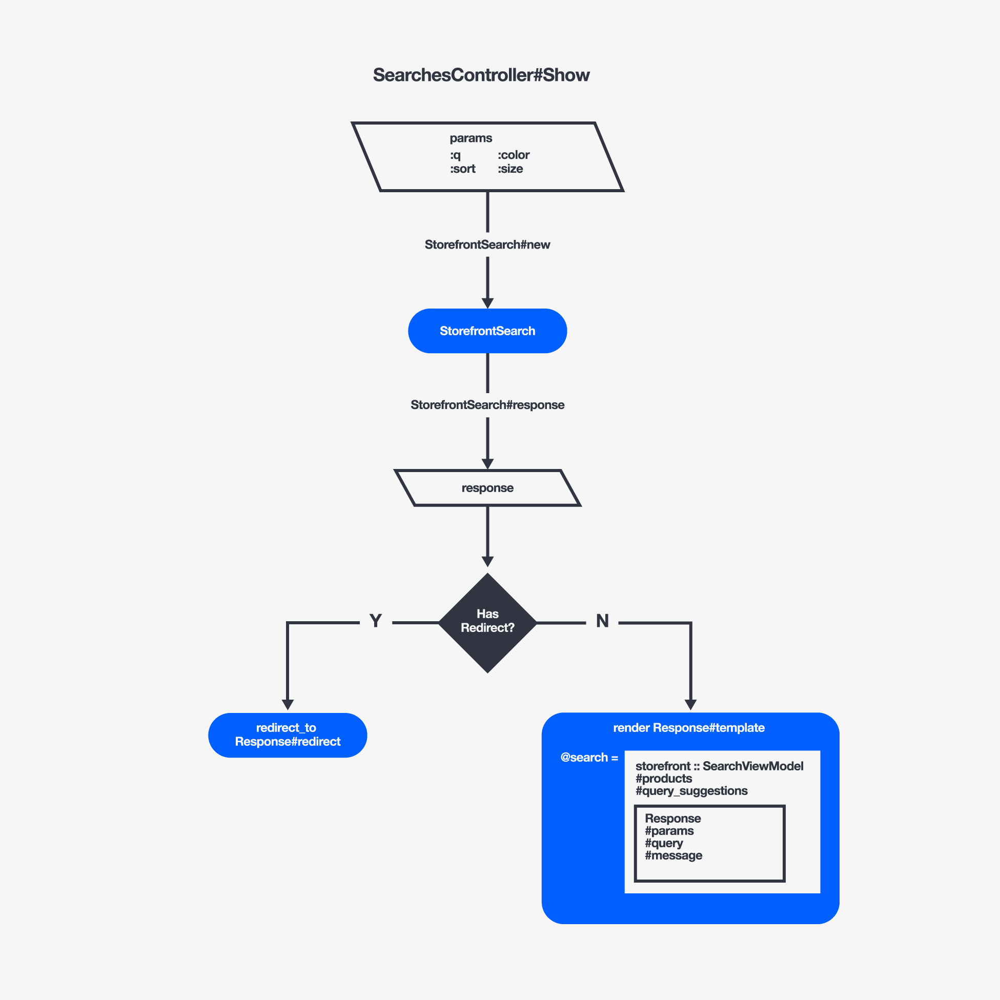
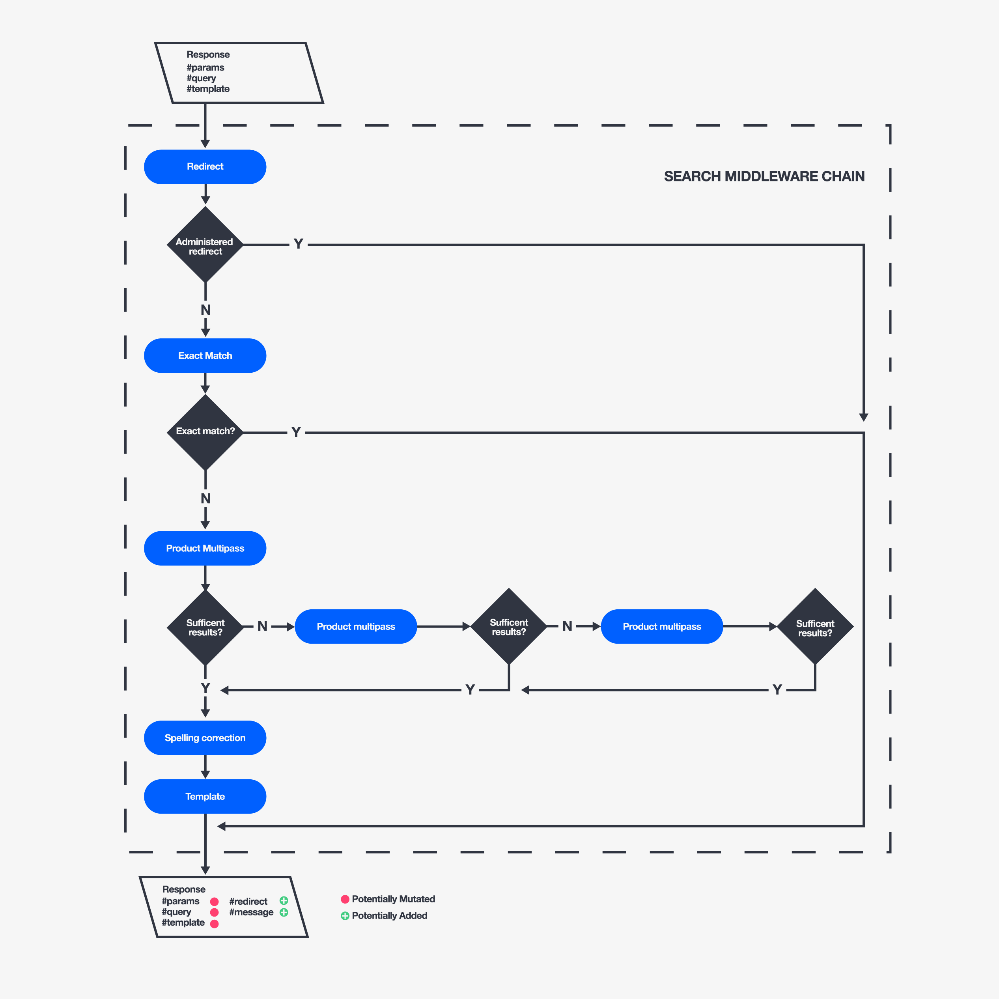

Storefront Searches
================================================================================

Each Storefront search feature uses a search query object to send a search request and receive a response from Elasticsearch.
However, the code path to initialize the search query is different for each feature.
(See [Storefront Search Features](storefront-search-features.html), specifically [Initialization & Parameters](storefront-search-features.html#initialization-amp-parameters_9).)

Storefront searches (i.e. search results pages) have the most complicated path to search query initialization.
A Storefront search request may be redirected to another URL, or the search query may be rewritten, possibly several times, in an attempt to provide better search results.

This document explains the code path of Storefront searches to enable developers to analyze, debug, and extend this feature as required for their applications and plugins.


Handling the Request
--------------------------------------------------------------------------------

At a high level, a Storefront search request is handled as follows.

The controller action `Storefront::SearchesController#show` uses the request params (which include data submitted by the user, such as the query string, sort, and filters) to create a `Search::StorefrontSearch`.
The `StorefrontSearch` is responsible for creating a _search response_ (`Search::StorefrontSearch::Response`).
The process to do so is covered in the next section.

The controller inspects the response to determine if the request should be redirected, and if so, redirects to the value specified by `Response#redirect`.
Otherwise, the controller wraps the response in a `Storefront::SearchViewModel` and renders the template specified by `Response#template`.

The following figure illustrates this process:



The `Response#query` is the search query object, an instance of `Search::ProductSearch`.
The view model wrapping the response adds the method `#products`, which wraps each result from the search query object in a `Storefront::ProductViewModel`, preparing the results for display in the Storefront.


Creating the Response
--------------------------------------------------------------------------------

The search response, introduced above, encapsulates the search query object and other data relevant to handling the shopper's search request and displaying the results.
This section explains in more detail how the response is created.

Recall from above that a `StorefrontSearch` is created from the controller's params.
This object uses the `:q` param, which represents the user's query, to look up any administration for this particular query, which is stored as a `Search::Customization`.
Then, the `StorefrontSearch` creates the `StorefrontSearch::Response` from the params and the search customization.

The Storefront search object creates a _search middleware chain_ and passes the search response through the chain.
Each search middleware has the opportunity to mutate the response, and each has the opportunity to "break" the chain, preventing the remaining middleware in the chain from running.
The following figure represents this flow:



All but the first of these middleware send the search query to Elasticsearch and examine the results.
Each middleware may decide to:

* Replace/rewrite the search query object (mutate `Response#params` and `Response#query`)
* Add a `Response#message`, which communicates the query changes to the end user
* Add a `Response#redirect`, indicating the user's query should be redirected instead of rendering results
* Change the `Response#template`, which determines which view is used to render the results (or lack of results)


## Search Middleware Chain

The value of `Workarea.config.storefront_search_middleware` is a [SwappableList](swappable-list-data-structure.html) which declares which search middleware are to run and in what order.
The following example lists the default middleware chain.

```ruby
puts Workarea.config.storefront_search_middleware
# Workarea::Search::StorefrontSearch::Redirect
# Workarea::Search::StorefrontSearch::ExactMatches
# Workarea::Search::StorefrontSearch::ProductMultipass
# Workarea::Search::StorefrontSearch::SpellingCorrection
# Workarea::Search::StorefrontSearch::Template
```

Developers can manipulate this config to add, swap, remove, or sort search middleware.
Developers can also [decorate](decoration.html) middleware to modify their behavior.

The following sections provide a brief explanation of each of the default search middleware.


### Redirect

`Workarea::Search::StorefrontSearch::Redirect` sets a redirect on the search response if the query has an administered redirect (i.e. the `Search::Customization` for the query has a `#redirect`).


### ExactMatches

`Workarea::Search::StorefrontSearch::ExactMatches` sets a redirect on the search response if there is an "exact match" product hit (and no filters).
It breaks the middleware chain when this redirect is set.

"Exact match" in this case is defined as a hit with a `_score` greater than or equal to `Workarea.config.search_exact_match_score` (defaults to `9999`).
This logic depends on scoring logic in the `Search::ProductSearch` query, which dramatically boosts the score of a document if the exact query string is contained within the document's `keywords.name`, `keywords.catalog_id`, or `keywords.sku` fields.


### ProductMultipass

`Workarea::Search::StorefrontSearch::ProductMultipass` initializes a new, replacement query object if the existing query does not have "sufficient" results.
The replacement query has a different `:pass` param, which changes the logic of the `Search::ProductSearch` query.
After replacing the query, this middleware runs again.
This process repeats, potentially creating a loop within the middleware chain, until the results of the query are "sufficient" or the "last" pass is reached.

The `:pass` param is a signal to Search::ProductSearch to cast a wider net for results.
In practice, the `:pass` param has the following effects on the request body:

* When `:pass` is `2`, the `content.description` field is added as a field to be searched
* When `:pass` is `3`, the query's operator changes from `AND` to `OR`

The 3rd pass is considered the "last" pass, at which point the results are always considered sufficient.

Prior to the last pass, "sufficient" results are defined as the number of hits being greater than or equal to `Workarea.config.search_sufficient_results` (defaults to `2`).
Results are also sufficient when the response from Elasticsearch includes at least one spelling correction suggestion (which the next middleware in the chain will use to rewrite the query).


### SpellingCorrection

`Workarea::Search::StorefrontSearch::SpellingCorrection` initializes a new, replacement query if there are zero results (and no filters).
The replacement query's `:q` param is set to the first value of the existing query's `#query_suggestions`, which are spelling correction suggestions provided by Elasticsearch.
It also sets `#message` on the search response, which will display on the results page in the Storefront to notify the user the query string has been rewritten.


### Template

`Workarea::Search::StorefrontSearch::Template` changes the response `#template` to `'no_results'` if there are still zero results (and no filters).
